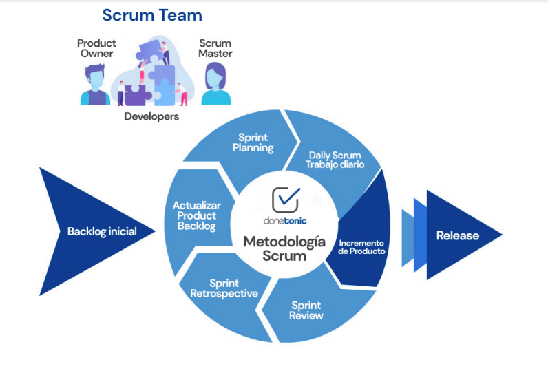
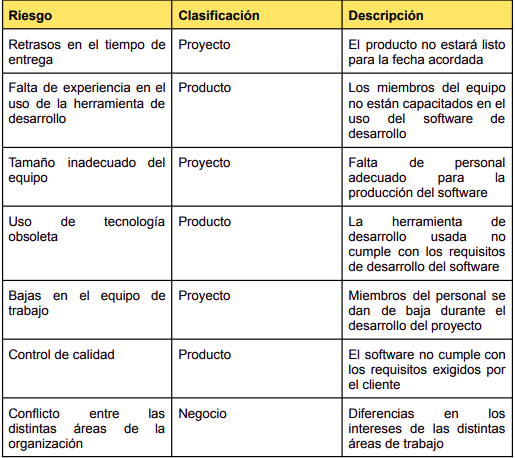
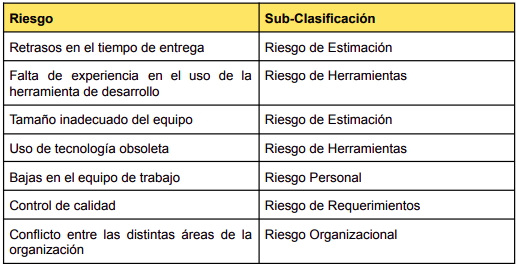
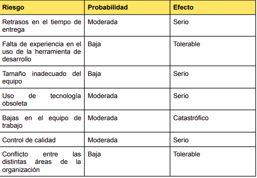
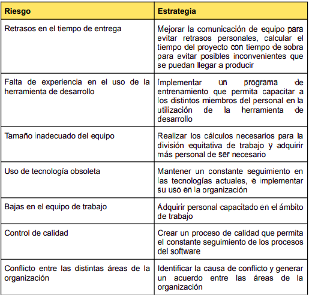
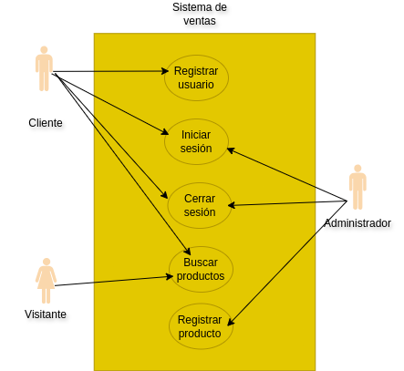
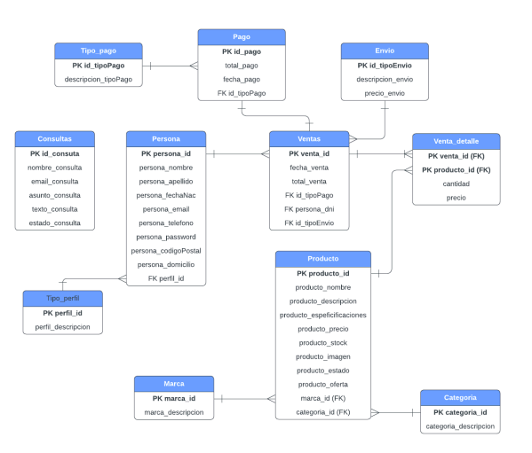

# Avance 1

## 1. Metodología

### Ciclo de Vida
El ciclo de vida del desarrollo de software abarca el proceso completo de creación de
un software nuevo, desde la etapa inicial de análisis hasta su implementación y
mantenimiento a largo plazo. Este proceso se divide en una serie de fases definidas:
análisis, diseño, implementación, pruebas y mantenimiento. El ciclo de vida del
software nos proporciona una metodología para identificar, administrar y planificar la
gestión de los recursos necesarios para alcanzar un objetivo específico de manera
eficiente y eficaz.
La metodología Agile Scrum será utilizada para el desarrollo de ventas de celulares
(CeluStore).

### ¿Por qué Scrum?
Scrum es una de las metodologías ágiles más populares en la actualidad debido a su
capacidad para adaptarse a los cambios y su enfoque flexible. Esto le permite
responder rápidamente a las necesidades cambiantes de nuestro proyecto. Además,
fomenta la colaboración estrecha entre los miembros del equipo, los stakeholders y el
cliente.

### ¿Qué es Scrum?
Scrum es un marco de gestión de proyectos de metodología ágil utilizado para la
gestión de proyectos. Se caracteriza por ser flexible, adaptable y colaborativo lo cual lo
hace ideal para entornos donde los requisitos del proyecto pueden cambiar o no están
completamente definidos al inicio.
El modelo Scrum se basa en un enfoque iterativo e incremental, donde el trabajo se
divide en ciclos cortos llamados "sprints" que duran generalmente de una a cuatro
semanas.
Por lo tanto, la Metodología Scrum es un sistema de gestión de proyectos que se basa
en el desarrollo incremental en sprints y una estructura clara para la colaboración y
comunicación efectiva entre los miembros del equipo y el cliente, permitiendo construir
productos complejos.
Scrum también cuenta con eventos clave como la reunión diaria de Scrum (Daily
Scrum), donde el equipo se sincroniza y revisa su progreso, la revisión del sprint
(Sprint Review), en la que se presenta el incremento del producto a los stakeholders,
la retrospectiva del sprint (Sprint Retrospective), donde el equipo reflexiona sobre su
desempeño y busca oportunidades de mejora, y la planificación del sprint (Sprint
Planning), donde se define el trabajo que se realizará en el siguiente sprint.

Por otro lado también se incluyen artefactos que ofrecen información importante que
el equipo de scrum utiliza para definir el producto y el trabajo que hay que hacer para
crearlo. Existen tres artefactos en scrum: un backlog del producto, un backlog de sprint
y un incremento
Un proyecto Scrum debe tener 3 roles:
1. Product Owner: Es el intermediario entre el equipo y el cliente. Se encarga de
actualizar todo el tiempo a las partes
2. Scrum Master: Lidera al equipo y se asegura de que la metodología se aplique
correctamente y sin obstáculos.
3. Equipo de Desarrollo: Es un equipo autoorganizado y multifuncional
compuesto por desarrolladores, diseñadores, testers y otros especialistas
necesarios para el proyecto. Es responsable de transformar el Product Backlog
en incrementos funcionales del producto durante cada sprint.

## 2. Planificación de Actividades
Una vez definidos los miembros del proyecto "CeluStore", se llevó a cabo una reunión
inicial de planificación (Sprint Planning) en la que se obtuvieron los requerimientos del
proyecto y se determinó la composición de la Pila del Producto (Product Backlog). En
la reunión estuvieron presentes el Scrum Master, el Product Owner, los
desarrolladores. Se analizaron las funcionalidades del proyecto y se priorizaron las que
se desarrollarían en el primer sprint. Además se determinó que la duración total del
sprint es de 4 semanas.

## 3. Plan de Riesgos
En la gestión de riesgos de un proyecto de desarrollo, es crucial identificar, evaluar y
mitigar posibles riesgos que puedan afectar el desarrollo, implementación o
mantenimiento del software. Esta parte del informe se enfoca en anticipar y planificar
para situaciones que podrían impactar negativamente en el proyecto. Al identificar
riesgos potenciales, se pueden implementar estrategias para minimizar su impacto o
evitarlos por completo. La gestión de riesgos en un informe ayuda a garantizar que el
proyecto se complete de manera exitosa y dentro de los plazos y presupuestos
establecidos.

#### Identificación

#### Sub-Clasificación

#### Análisis 

### Planificación de estrategias

## 4. Historias de usuario

## 5. Diagrama de Casos de uso

## 6. Implementación de conversaciones

## 7. Diagrama de secuencia

## 8. Contrato de operaciones críticas

## 9. Diagrama de Entidad Relación del sistema

## 10. Arquitectura utilizada

## 11. Herramientas utilizadas

## 12. Bibliografía 

