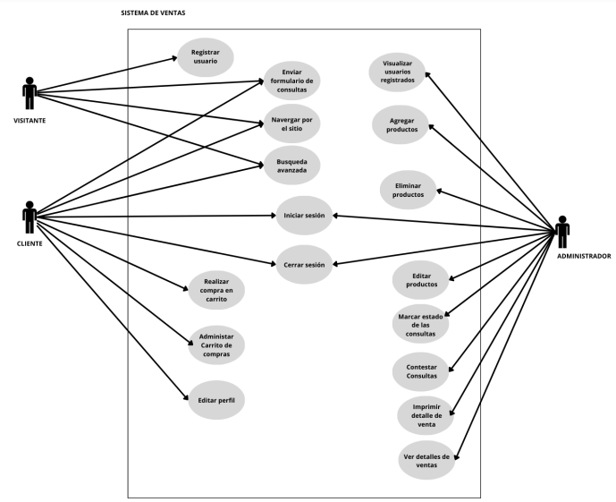
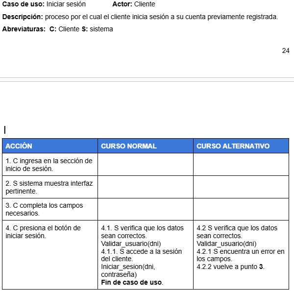
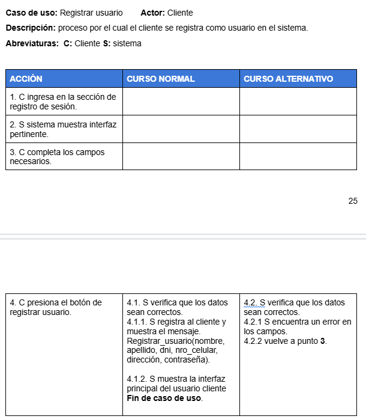
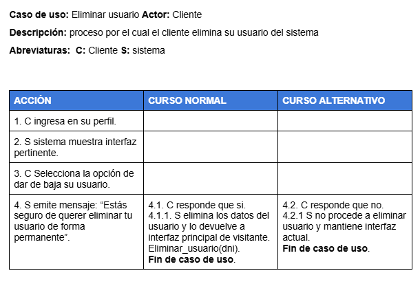
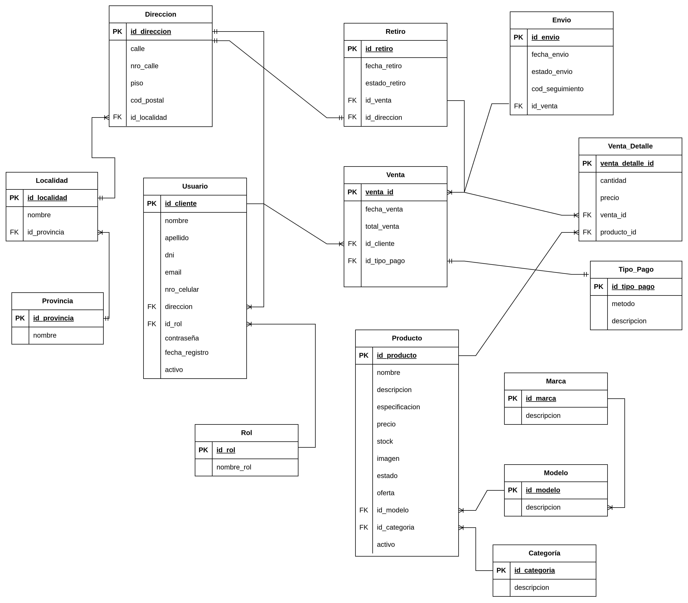
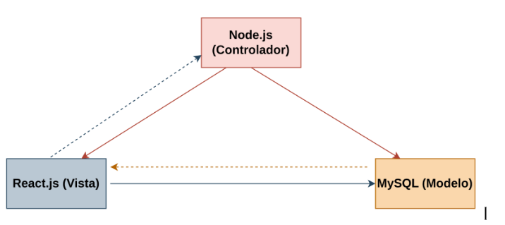

# Avance 1

## 1. Metodología

### Ciclo de Vida
El ciclo de vida del desarrollo de software abarca el proceso completo de creación de
un software nuevo, desde la etapa inicial de análisis hasta su implementación y
mantenimiento a largo plazo. Este proceso se divide en una serie de fases definidas:
análisis, diseño, implementación, pruebas y mantenimiento. El ciclo de vida del
software nos proporciona una metodología para identificar, administrar y planificar la
gestión de los recursos necesarios para alcanzar un objetivo específico de manera
eficiente y eficaz.
La metodología Agile Scrum será utilizada para el desarrollo de ventas de celulares
(CeluStore).

### ¿Por qué Scrum?
Scrum es una de las metodologías ágiles más populares en la actualidad debido a su
capacidad para adaptarse a los cambios y su enfoque flexible. Esto le permite
responder rápidamente a las necesidades cambiantes de nuestro proyecto. Además,
fomenta la colaboración estrecha entre los miembros del equipo, los stakeholders y el
cliente.

### ¿Qué es Scrum?
Scrum es un marco de gestión de proyectos de metodología ágil utilizado para la
gestión de proyectos. Se caracteriza por ser flexible, adaptable y colaborativo lo cual lo
hace ideal para entornos donde los requisitos del proyecto pueden cambiar o no están
completamente definidos al inicio.
El modelo Scrum se basa en un enfoque iterativo e incremental, donde el trabajo se
divide en ciclos cortos llamados "sprints" que duran generalmente de una a cuatro
semanas.
Por lo tanto, la Metodología Scrum es un sistema de gestión de proyectos que se basa
en el desarrollo incremental en sprints y una estructura clara para la colaboración y
comunicación efectiva entre los miembros del equipo y el cliente, permitiendo construir
productos complejos.
Scrum también cuenta con eventos clave como la reunión diaria de Scrum (Daily
Scrum), donde el equipo se sincroniza y revisa su progreso, la revisión del sprint
(Sprint Review), en la que se presenta el incremento del producto a los stakeholders,
la retrospectiva del sprint (Sprint Retrospective), donde el equipo reflexiona sobre su
desempeño y busca oportunidades de mejora, y la planificación del sprint (Sprint
Planning), donde se define el trabajo que se realizará en el siguiente sprint.

Por otro lado también se incluyen artefactos que ofrecen información importante que
el equipo de scrum utiliza para definir el producto y el trabajo que hay que hacer para
crearlo. Existen tres artefactos en scrum: un backlog del producto, un backlog de sprint
y un incremento
Un proyecto Scrum debe tener 3 roles:
1. Product Owner: Es el intermediario entre el equipo y el cliente. Se encarga de
actualizar todo el tiempo a las partes
2. Scrum Master: Lidera al equipo y se asegura de que la metodología se aplique
correctamente y sin obstáculos.
3. Equipo de Desarrollo: Es un equipo autoorganizado y multifuncional
compuesto por desarrolladores, diseñadores, testers y otros especialistas
necesarios para el proyecto. Es responsable de transformar el Product Backlog
en incrementos funcionales del producto durante cada sprint.

## 2. Planificación de Actividades
Una vez definidos los miembros del proyecto "CeluStore", se llevó a cabo una reunión
inicial de planificación (Sprint Planning) en la que se obtuvieron los requerimientos del
proyecto y se determinó la composición de la Pila del Producto (Product Backlog). En
la reunión estuvieron presentes el Scrum Master, el Product Owner, los
desarrolladores. Se analizaron las funcionalidades del proyecto y se priorizaron las que
se desarrollarían en el primer sprint. Además se determinó que la duración total del
sprint es de 4 semanas.

## 3. Plan de Riesgos
En la gestión de riesgos de un proyecto de desarrollo, es crucial identificar, evaluar y
mitigar posibles riesgos que puedan afectar el desarrollo, implementación o
mantenimiento del software. Esta parte del informe se enfoca en anticipar y planificar
para situaciones que podrían impactar negativamente en el proyecto. Al identificar
riesgos potenciales, se pueden implementar estrategias para minimizar su impacto o
evitarlos por completo. La gestión de riesgos en un informe ayuda a garantizar que el
proyecto se complete de manera exitosa y dentro de los plazos y presupuestos
establecidos.

#### Identificación

#### Sub-Clasificación

#### Análisis 

### Planificación de estrategias

## 4. Historias de usuario

## 5. Diagrama de Casos de uso

## 6. Implementación de conversaciones

## 7. Diagrama de secuencia

## 8. Contrato de operaciones críticas

## 9. Diagrama de Entidad Relación del sistema

## 10. Arquitectura utilizada

La arquitectura que utilizamos para realizar esta aplicación web es Modelo Vista Controlador (MVC). 
Las razones por las cuales elegimos esta arquitectura son las siguientes: 
Separación de responsabilidades: El Modelo se encarga de la lógica de negocio y la interacción con la base de datos. Por otro lado, Node.js maneja las peticiones del servidor y la lógica del backend, mientras que React.js se ocupa de la interfaz de usuario. Esta separación facilita entender cómo se estructura el sistema y hace que el código sea mucho más fácil de mantener. Si necesitas cambiar algo en el backend o en la vista, puedes hacerlo sin afectar el resto del sistema.
Escalabilidad: MVC permite que, a medida que aumenten las funcionalidades, el sistema siga siendo fácil de administrar. Constantemente se hacen mejoras en la interfaz, en los requerimientos del sistema, y por esto es necesario brindar una arquitectura que se adapte a esto.
Facilidad en el trabajo en equipo: En este proyecto hubo varios desarrolladores trabajando en distintas partes del sistema. Con MVC, pudimos trabajar de manera independiente. Los desarrolladores que se encargan de la vista (en este caso, los que usan React.js) no interfieren con los que están trabajando en el backend (Node.js). Esto permite una mejor colaboración y mejora la productividad del equipo.

## 11. Herramientas utilizadas

1. draw.io
Descripción:
 Draw.io es una herramienta de diagramación en línea que permite crear diagramas de flujo, diagramas de arquitectura, mapas mentales y más.
 Uso en el proyecto:
 Se utilizó para diseñar la arquitectura del sistema, esquemas de bases de datos y flujos de trabajo. Su integración con plataformas como Google Drive facilita el almacenamiento y la colaboración en tiempo real.

2. GitHub
Descripción:
 GitHub es una plataforma de desarrollo colaborativo que permite gestionar el control de versiones mediante Git. Es ampliamente utilizada para proyectos de software y código abierto.
 Uso en el proyecto:
 Se empleó para gestionar el código fuente, realizar seguimiento de cambios mediante commits, y colaborar con otros miembros del equipo de desarrollo. 

3. Google Drive
Descripción:
 Google Drive es un servicio de almacenamiento en la nube que permite almacenar y compartir archivos, además de colaborar en documentos de manera simultánea.
 Uso en el proyecto:
 Se utilizó para almacenar documentación técnica, informes, y diagramas, permitiendo el acceso y edición colaborativa entre los miembros del equipo.

4. Discord
Descripción:
 Discord es una plataforma de comunicación en tiempo real que facilita la mensajería instantánea, las videollamadas y las reuniones en línea.
 Uso en el proyecto:
 Se utilizó para la comunicación diaria entre el equipo de desarrollo, facilitando discusiones rápidas, resolución de problemas y coordinación de tareas mediante canales de texto y voz.

5. Node.js
Descripción:
 Node.js es un entorno de ejecución para JavaScript en el lado del servidor. Permite ejecutar código JavaScript fuera del navegador, lo que lo hace ideal para aplicaciones escalables y de alto rendimiento.
 Uso en el proyecto:
 Se usó para construir el backend de la aplicación debido a su rendimiento.

6. React.js
Descripción:
 React.js es una librería de JavaScript para construir interfaces de usuario interactivas. Se enfoca en la creación de componentes reutilizables y eficientes.
 Uso en el proyecto:
 React.js fue elegido para construir el frontend de la aplicación, permitiendo crear interfaces dinámicas y reactivas, mejorando la experiencia del usuario mediante la renderización eficiente de los componentes.

7. Express
Descripción:
 Express es un framework minimalista y flexible para Node.js, utilizado para crear aplicaciones web y APIs. Facilita el manejo de rutas, middleware y solicitudes HTTP.
 Uso en el proyecto:
 Se empleó para estructurar el servidor backend de manera rápida y eficiente, manejando rutas, peticiones y la comunicación entre el frontend y la base de datos.
8. Prisma
Descripción:
 Prisma es un ORM (Object-Relational Mapping) para Node.js y TypeScript, que facilita la interacción con bases de datos mediante un modelo de datos de alto nivel y una sintaxis clara.
 Uso en el proyecto:
 Se utilizó Prisma para gestionar las interacciones con la base de datos de manera eficiente, permitiendo realizar consultas y mutaciones de datos con un código más limpio y mantenible.

9. MySQL
Descripción:
 MySQL es un sistema de gestión de bases de datos relacional (RDBMS) ampliamente utilizado, basado en SQL (Structured Query Language).
 Uso en el proyecto:
 MySQL fue la base de datos elegida para almacenar la información de la aplicación. Ofrece un alto rendimiento y es muy adecuado para gestionar grandes volúmenes de datos con relaciones complejas.

10. DBeaver
Descripción:
 DBeaver es una herramienta de administración de bases de datos universal que permite conectar y gestionar diversas bases de datos, incluyendo MySQL, PostgreSQL, Oracle y más.
 Uso en el proyecto:
 Se utilizó DBeaver para administrar y gestionar las bases de datos de MySQL, realizar consultas complejas y visualizar los datos de manera eficiente, facilitando el desarrollo y la administración.

11. phpMyAdmin
Descripción:
 phpMyAdmin es una herramienta de administración de bases de datos MySQL escrita en PHP. Permite gestionar bases de datos MySQL a través de una interfaz web.
 Uso en el proyecto:
 Se usó phpMyAdmin como una opción alternativa para gestionar las bases de datos MySQL, realizar consultas rápidas, y facilitar la administración de las tablas y relaciones.

12. Trello
Descripción:
 Trello es una herramienta de gestión de proyectos visual basada en el sistema de tableros y tarjetas. Permite organizar tareas, asignarlas a miembros del equipo, establecer fechas límite, y hacer un seguimiento del progreso en tiempo real.
 Uso en el proyecto:
 Se utilizó para gestionar las tareas del equipo, visualizar el progreso de cada tarea y asignar responsabilidades. Los tableros fueron configurados para reflejar los distintos estados del proyecto, desde las tareas pendientes hasta las completadas, lo que facilitó el seguimiento y la colaboración continua.

13. Power-Up de Gantt (para Trello)
Descripción:
 El Power-Up de Gantt para Trello permite integrar un gráfico de Gantt directamente dentro de los tableros de Trello, facilitando la planificación visual del proyecto a través de una línea de tiempo. Este Power-Up transforma las tarjetas de Trello en tareas con fechas específicas y dependencias visualizadas en un formato de cronograma.
 Uso en el proyecto:
 Se utilizó para planificar y visualizar el cronograma del proyecto. El Power-Up de Gantt permitió asignar fechas a las tareas de Trello, organizarlas por prioridad y ver cómo cada tarea dependía de otras. Esto mejoró la gestión de tiempos y ayudó a cumplir con los plazos establecidos.

## 12. Bibliografía 

